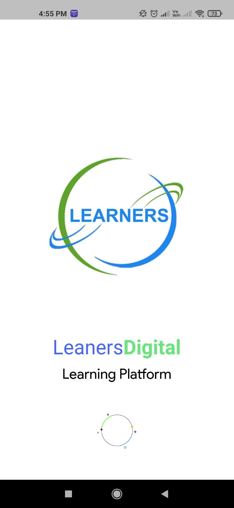
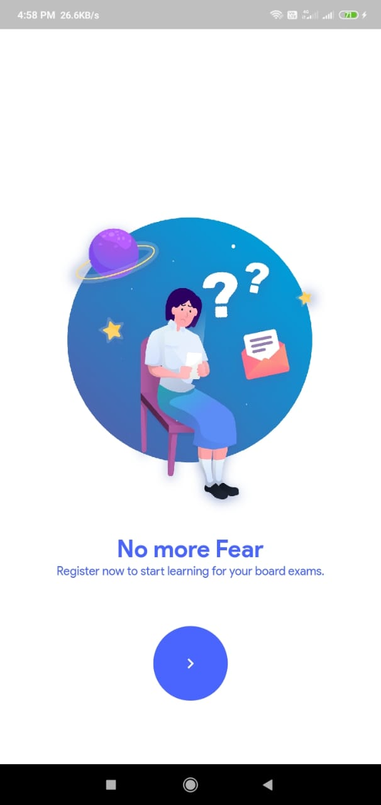
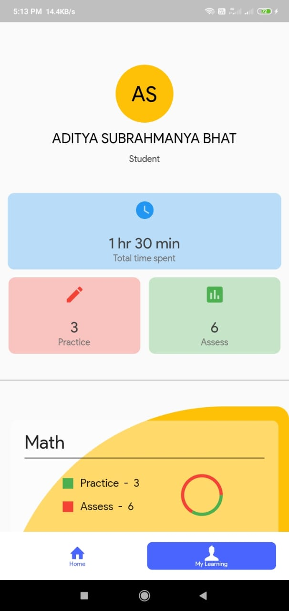
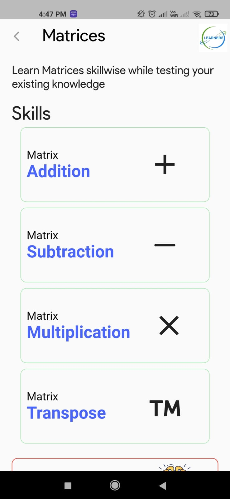
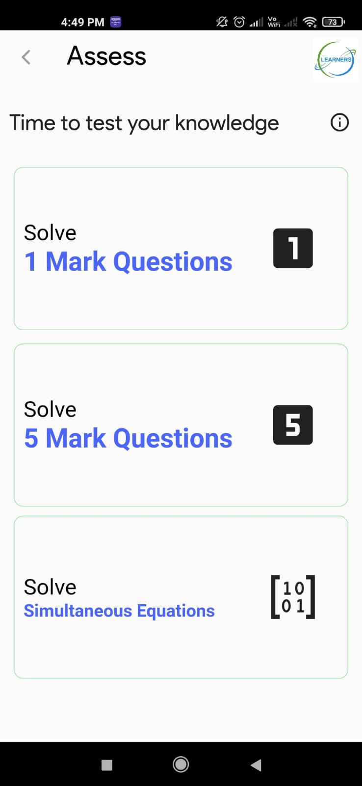
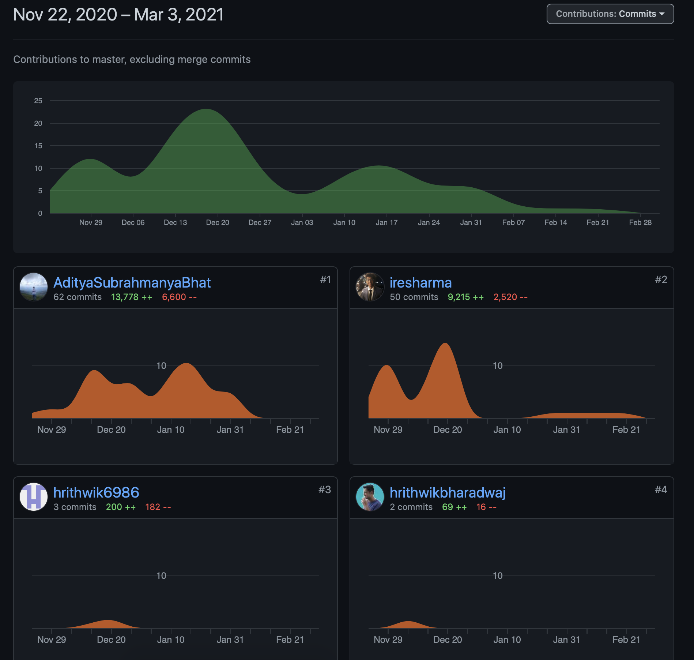

# Learner's Digital App

An Edtech solution for PU students where they can visualize and learn basic topics like matrices and score better.

## Try it

## Tech Stack

- Flutter  [ Lead by: [@iresharma](https://github.com/iresharma) along with [@Aditya Subrahmanya Bhat](https://github.com/AdityaSubrahmanyaBhat) ]
- Express API  [ Lead by: [@CodeKulkarni](https://github.com/sgkul2000) along with [@Hrithwik](https://github.com/hrithwikbharadwaj) ]
- MongoDB 
- Firebase  - for authentication and push notifications
- GoLang  - for notifications and emailer

## New things I Learnt

- Type Save http calls in flutter using something called [chopper]() for flutter which is dubbed retrofit for flutter
  - here's my blog on the same [blog](https://watchireshstruggle.hashnode.dev/chopper-flutter)

- MVP (Model-View-Presentor) architecture for flutter
  - here's my blog on the same [blog](https://watchireshstruggle.hashnode.dev/mvpflutter)

- Caching in flutter using [HiveDb]
  - Blog coming soon, [checkout](https://watchireshstruggle.hashnode.dev)

## Major Setbacks and solutions

### Latex Support

All flutter packages for latex support use webviews, which completely makes sense as flutter is not an html renderer and hence to render such content we can open a webview to render using js libraries. Now the first problem we faced was these packages only being able to use `raw strings` the initial version of the app had a random problem generator and hence I was generating latex syntax on the go. Unlike js, dart doesn't support/have `string.raw()` and hence I couldn't figure out any way to convert a generated string into a raw string. But luckily requirements changed and now we were keeping a fixed set of questions on our db and using them, so the solution was sending raw strings from our Mode (Express) based server. Initially for 1 or 2 Matrices -> Latex -> Web view per page were ok, but then as the app matured we had pages where we had more than 3 or 4 webviews per page which ended up slowing down the app considerably. This was a mojor setback but overcame this, initial solution was a [python based microservice](https://github.com/iresharma/latexMicroService) which could render latex and return an image (png) over https -- Perfect ? No Life isn't that easy this service used a system dependency called [WKHTMLtoPDF](https://wkhtmltopdf.org) along with an image processing py dependency called [Pillow](https://pypi.org/project/Pillow/) the problem was we had to use heroku for our hosting and we couldn't how setup such an environment on heroku (I am aware that heroku supports containers but given the time crunch that looked like too much work) but finally we found an open Node.js based docker which does the same so that's how we solved this

### ScreenShots

| SplashScreen |
|--------------|
|  |

#### Auth and Intro

| Auth | Intro |
|---|---|
|  |  |

#### Home and Profile

| Home | Profile |
|---|---|
|  |  |

#### Menus

| 1 | 2 |
|---|---|
|  |  | 

#### Question Screens

| 1 |
|--------------|
|  |

### Team 

##### Contributions to main app

